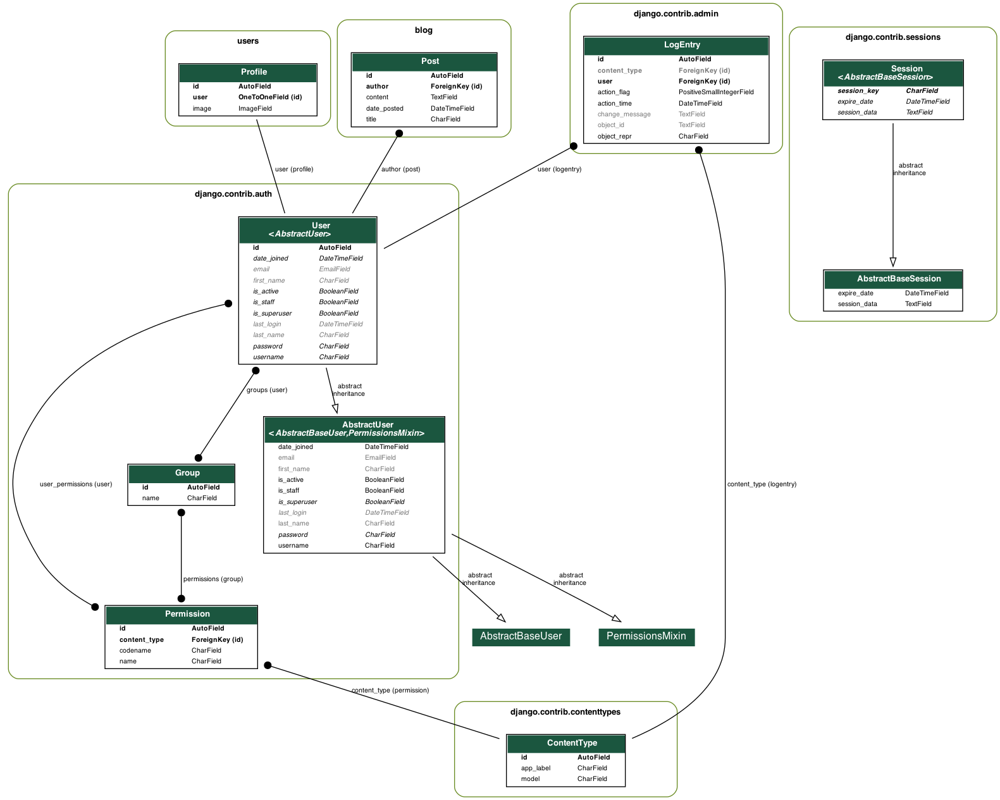

# Blog project

A simple blog app build on django. Deployed on heroku [here](https://lk-django-blog.herokuapp.com/)

- Static files are stored using S3 Bucket

## App initial setup:

- `pipenv shell` to start your virtual environment
- `pipenv install` to install dependencies
- create .env file with listed <a href="#env">below</a> variables and save it into 'test_project' directory
- `python manage.py makemigrations` - to generate DB schema
- `python manage.py migrate` - to create DB schema
- `python manage.py createsuperuser` - to create user with admin access
- `python manage.py collectstatic` - to collect apps static files
- `python manage.py runserver` - to run server

- `python manage.py graph_models -a -g -o ERD.png` to generate ERD diagram

##  ENV variables:

SECRET_KEY=secret key for the app (typically 50-characters long string)  
DEBUG=should be set to True in development  
ALLOWED_HOSTS=localhost,127.0.0.1 (for testing)  
AWS_STORAGE_BUCKET_NAME=Name of your S3 bucket storage  
AWS_ACCESS_KEY_ID=S3 bucket key ID  
AWS_SECRET_ACCESS_KEY=S3 bucket access key

## Routes:

`/` - Blog landing page;  
`about/` - Blog about page;  
`post/<post_id>/` - Post Detail view;  
`post/new/` - Post Create view;  
`post/<post_id>/update/` - Post Update view;  
`post/<post_id>/delete/` - Post Delete view;  
`user/<username>/` - Shows all posts written by the user;  
`/login/` - login page, allows registered user to log in;  
`/register/` - register page, handles user registration;  
`/profile/` - allows registered user to edit their account information, requires login;  
`/logout/` - logout page, allows registered user to log out;  
`/password-reset/` - passwor reset page, requires login;  
`/admin/` - site admin page

## Additional information:

## DB Schema:

## Dependency Documentation:

[Django (v. 3.0.8)](https://docs.djangoproject.com/en/3.0/)  
[Django-Crispy-Forms (v. 1.9.2)](https://pypi.org/project/django-crispy-forms/)  
[Pillow](https://pypi.org/project/Pillow/)  
[django-cleanup](https://pypi.org/project/django-cleanup/)  
[gunicorn](https://pypi.org/project/gunicorn/)  
[boto3](https://pypi.org/project/boto3/)  
[django-storages](https://pypi.org/project/django-storages/)  
[django-heroku](https://pypi.org/project/django-heroku/)  
[psycopg2-binary](https://pypi.org/project/Pillow/)

### Dev Dependencies:

[PyGraphViz](https://pypi.org/project/pygraphviz/)  
[Django-Extensions](https://pypi.org/project/django-extensions/)  
[PyParsing](https://pypi.org/project/pyparsing/)  
[PyDot](https://pypi.org/project/pydot/)

## CREDITS:

[Entire tutorial](https://www.youtube.com/playlist?list=PL-osiE80TeTtoQCKZ03TU5fNfx2UY6U4p)

[Autoresize images for S3Bucket](https://gist.github.com/caiolopes/a9f2bd942fa2d18412ac0d68a915eedf)

[Link to PR](https://github.com/LeoKuhorev/django-blog/pull/2)
